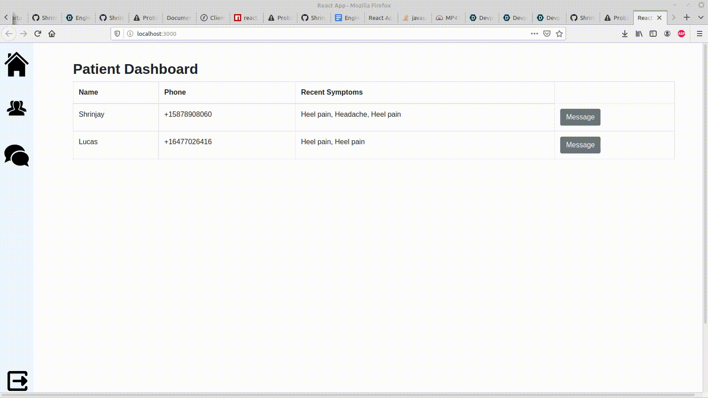

## Demo

## Inspiration ❗
Have you ever been sat in a doctor's waiting room, eager to get in and get out as fast as possible - and then realized that you've been waiting for upwards of an hour and counting? So have we. So has everyone. Now, we don't know about you, but we're not particularly a fan of this kind of turnover - so we decided to remove it. With our app, we hope to smooth over the rough timeframe between an initial screening and the appointment you need.

## What it does 💭
Our app caters to all parties that use it - there is no sole person taking all the benefit! On the web-app side, we have a person in a doctoral position who will converse with their patients through the website interface. The patients will respond via SMS and a natural conversation will be held. Throughout this conversation, sentences are continuously analyzed and parsed to find out whether they contain medical data that could aid the doctor with data gathering. These sentences are then picked apart and carefully placed in a datasheet prototype that the doctor can then use to instantiate an appointment.

## How we built it ❓
Our app was built solely using Python and Javascript for the innards, and the classic HTML/CSS combination as the skeleton. Our backend was architected using Flask, MongoDB, and two APIs - the Twilio REST API and the Google Cloud Natural Language Processing API. The frontend was built using React and then spliced together with the backend with HTTP request/response communication. The custom API we wrote to handle text sending and reception was host via a set of sockets, allowing for lightning fast query speed.

## Challenges 😣
In reality, this hackathon transpired quite smoothly. We used a feature-branch Git workflow to seamlessly collaborate and help each other out via pull requests when we needed a hand. Most of the challenges we ran into really came from the time limit being a bit short for the scale of our project! Throughout the last night leading up to the end of the hackathon, we could be seen scrambling to get everything ready for demo.

## Accomplishments 🏆
In reality, the biggest accomplishment we can think of is having a working prototype for this app. Going into the hackathon, we had a plethora of ideas waiting to be implemented. So much so, that we actually had to shave some off to keep our sanity in check! Another incredible accomplishment we believe is worth mentioning is how organized we stayed throughout the hackathon. We began with an great architecture, stuck to our plan, used agile-type delegation, and came out feeling great!

## What we learned 🧠
Our group learned a lot of different things this hackathon! This ranged from socket implementation all the way to fixing relative file pathing errors! There truly isn't enough to fit in this passage.

## What's next for DMnMD ▶️
We were going to add an auto-diagnose feature, but in the interest of time decided to scrap this idea. This may be on the agenda!

We recognize that our app actually has a valid use-case in everyday life, and as we inch towards a more autonomous future, this type of time-saving can prove very useful. Perhaps you'll see DMnMD while booking your next appointment!
